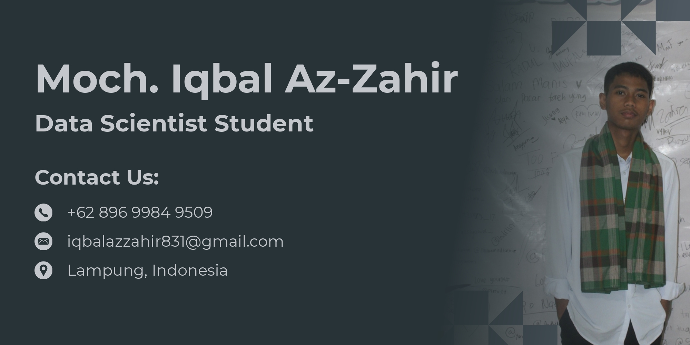

# 
<strong>Hi there :wave: , I'm Iqbal!</strong>

Lifelong Learner, currently working as budagh kompeni.

 

### 
<strong>Tools:</strong>

    

### 
<strong>Yosh!</strong>

    - :keyboard: I’m currently learning Data Analytics.  
    - :speech_balloon: Ask me about anything. 
    - :mailbox: How to reach me: <a href="mailto:iqbalazzahir831@gmail.com">Email me!</a>   
    - :cloud: Pronouns: He/His.  
    - :game_die: Sleep and writing are part of me.  

 
### 
<strong>Let's connect!</strong>

    
    

